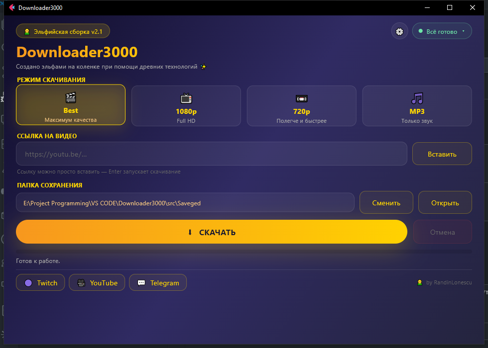
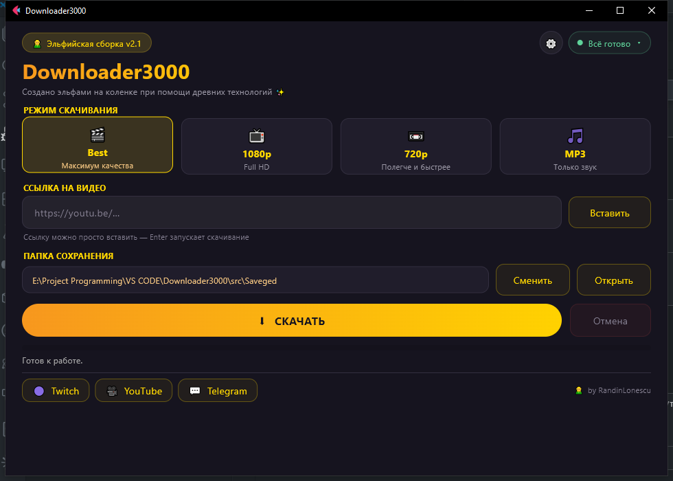
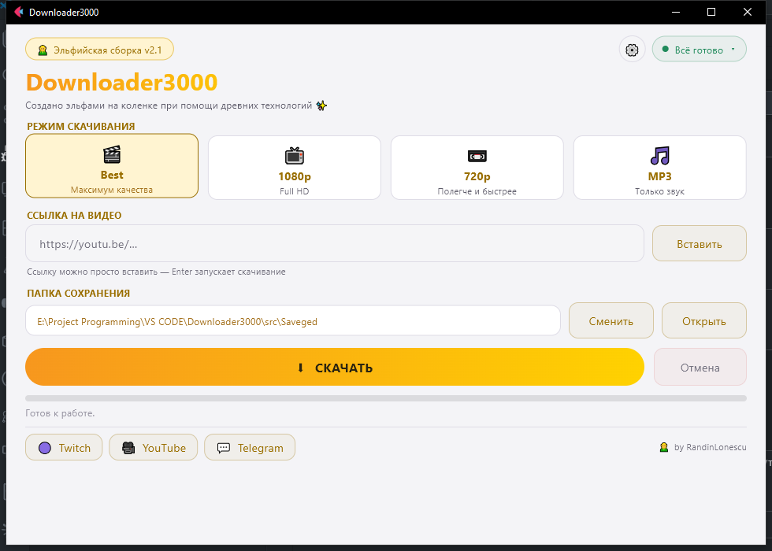

<div align="center">

# 🎬 Downloader3000

**Загрузчик видео и музыки в один клик. Эльфийская сборка.**

[](https://github.com/Ratio0-sys/Downloader3000/releases/latest)
[](#установка)
[](https://www.python.org/)
[](LICENSE)

**[🌐 Сайт](https://ratio0-sys.github.io/Downloader3000/)** ·
**[📦 Скачать](https://github.com/Ratio0-sys/Downloader3000/releases/latest)** ·
**[💻 Исходники](https://github.com/Ratio0-sys/Downloader3000)**



</div>

---

## Что это

Вставил ссылку, выбрал качество, нажал кнопку — файл лежит в папке.
Работает с YouTube и сотнями других сайтов.

Раньше это были четыре `.bat`-файла, которые приходилось править блокнотом.
Теперь одно приложение с нормальным интерфейсом на четырёх платформах.

## Что умеет

| | Режим | Что делает |
| --- | --- | --- |
| 🎬 | **Best** | Максимальное доступное качество |
| 📺 | **1080p** | Full HD, файл поменьше |
| 📼 | **720p** | Ещё легче и быстрее |
| 🎵 | **MP3** | Только звук, с обложкой и тегами |

- **Плейлисты по выбору.** Ссылка на плейлист разворачивается в список
  с галочками — отмечаете нужное, остальное не качается.
- **Два языка** — русский и английский, определяется по системе.
- **Три оформления** — «Оригинал», «Тёмная», «Светлая».
- **Масштаб интерфейса** от 80 % до 150 %.
- Прогресс со скоростью и оставшимся временем, работающая кнопка отмены.
- Живой лог: при ошибке видно, что именно сломалось.
- Названия сохраняются оригинальными, включая русские буквы и спецсимволы.

<div align="center">


</div>

## Установка

Скачайте файл для своей системы со страницы
**[релизов](https://github.com/Ratio0-sys/Downloader3000/releases/latest)**
и запустите. Больше ничего делать не нужно — ffmpeg уже внутри.

| Система | Требования |
| --- | --- |
| Windows | 10 или новее |
| Linux | glibc 2.31+ (Ubuntu 20.04+, Debian 11+) |
| macOS | 11 или новее |
| Android | 6.0 или новее |

### Из исходников

```bash
git clone https://github.com/Ratio0-sys/Downloader3000.git
cd Downloader3000

python -m venv .venv
.venv\Scripts\activate        # Windows
source .venv/bin/activate     # Linux / macOS

pip install -e "src[dev]"
python src/main.py
```

### Собрать самому

```bash
flet build windows src     # .exe
flet build linux   src     # исполняемый файл Linux
flet build macos   src     # .app
flet build apk     src     # Android
```

Под macOS собирается только на macOS, под Linux — на Linux.
Остальное собирается откуда угодно, Flutter и Android SDK сборщик подтянет сам.
Для всех платформ сразу есть [готовый workflow](.github/workflows/build.yml).

## Как устроено

```text
README.md              этот файл
CHANGELOG.md           история версий
docs/                  сайт проекта и скриншоты
tools/                 вспомогательные скрипты разработки
Release/               готовые сборки
src/
├── main.py            точка входа
├── pyproject.toml     зависимости и метаданные сборки
├── assets/            иконка и файлы локализации
└── app/
    ├── theme.py       палитры и размеры
    ├── engine.py      обёртка над yt-dlp
    ├── i18n.py        локализация
    ├── settings.py    настройки пользователя
    ├── platform_paths.py   различия Windows / Linux / macOS / Android
    └── ui/            интерфейс
```

Весь код прокомментирован по-русски: можно открыть любой файл
и разобраться, что там происходит и почему именно так.

## Что честно сказать про ограничения

Это не баги, а объективные вещи.

**ffmpeg обязателен для видео.** YouTube больше не отдаёт картинку и звук
одним файлом — только раздельными потоками, которые нужно склеивать.
Проверено на живом ролике: 32 потока без звука, 11 без картинки,
ни одного совмещённого. В готовых сборках ffmpeg уже внутри.

**Windows 7 и 8.1 не поддерживаются.** Современный yt-dlp требует Python 3.10+,
который на них не устанавливается. Официальные сборки самого yt-dlp тоже
уже требуют Windows 10. Обойти это нельзя.

**На Android возможности урезаны.** ffmpeg там недоступен, поэтому склейка
и конвертация в MP3 не работают. Программа сама определит ситуацию
и напишет, что доступно.

**Движок JavaScript уже внутри.** YouTube требует исполнения JS, чтобы отдать
полный список форматов. В готовые сборки вшит QuickJS, поэтому ставить ничего
не нужно. Если в системе есть `node`, `deno` или `bun` — программа возьмёт их:
они решают задачу быстрее.

## Если что-то не работает

| Симптом | Что делать |
| --- | --- |
| «ffmpeg не найден» | Положите `ffmpeg` рядом с программой или поставьте в систему |
| «JS-движок не найден» | В сборках он вшит; при запуске из исходников поставьте [Node.js](https://nodejs.org) или выполните `python tools/fetch_quickjs.py` |
| «Видео недоступно» | Приватное, удалённое или заблокированное в регионе |
| «Нет связи с сервером» | Проверьте интернет и настройки прокси |
| Качество ниже ожидаемого | Обычно это отсутствие ffmpeg или JS-движка |
| Ничего не помогает | Разверните кнопку состояния — в логе написана настоящая причина |

## Участие

Правки приветствуются — см. [CONTRIBUTING.md](CONTRIBUTING.md).
Об ошибках пишите в [issues](https://github.com/Ratio0-sys/Downloader3000/issues).

## Лицензия

[MIT](LICENSE). Сделано для личного использования.
Эльфы не несут ответственности за нарушение авторских прав.

Да прибудет с вами качественное видео! ✨

<div align="center">

🧝 **by RandinLonescu** 🧝

[Twitch](https://www.twitch.tv/randinlonescu) ·
[YouTube](https://www.youtube.com/@RandinLonescu) ·
[Telegram](https://t.me/RandinLonescu)

</div>
